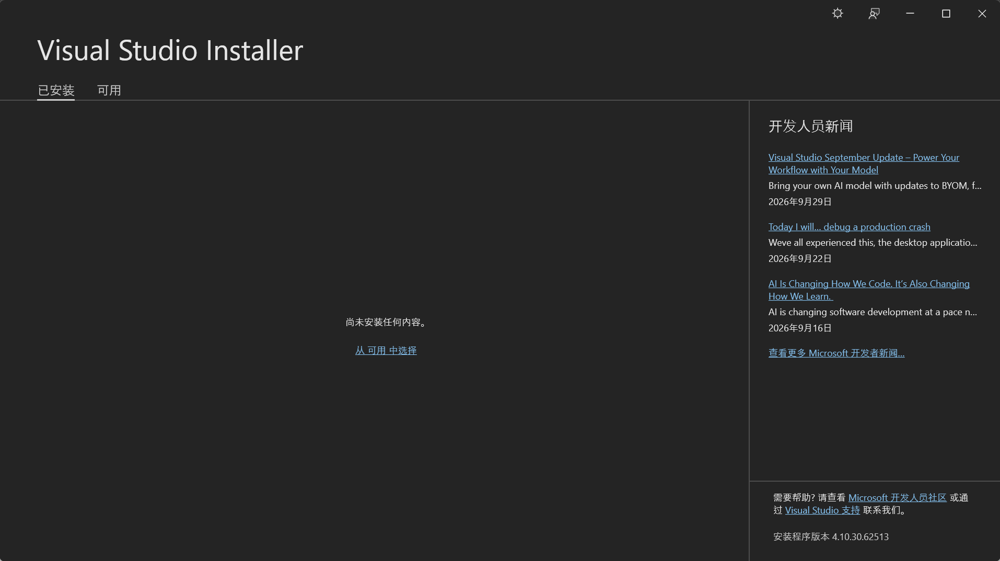
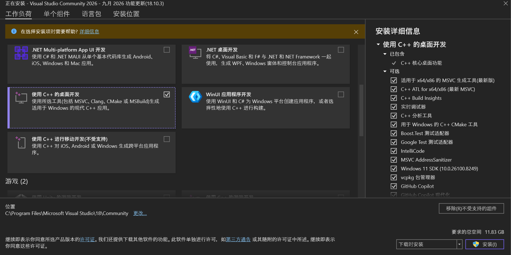
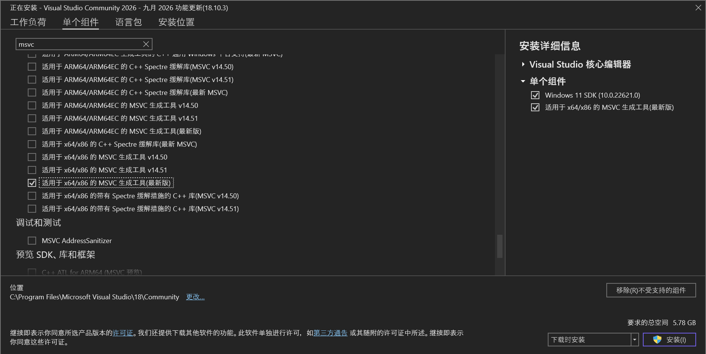
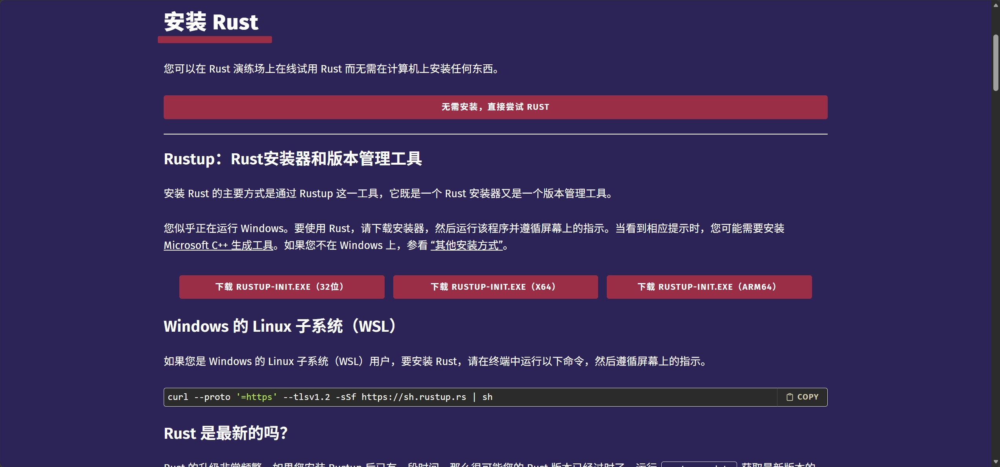
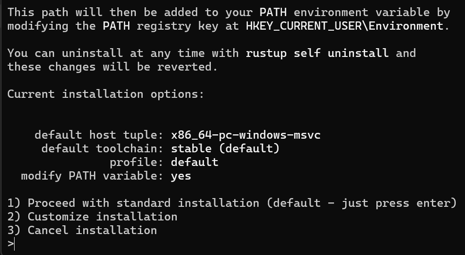

## 0x01 先说清楚：这门语言在解决什么问题

我写过不少 Rust 代码。最早用 Java 开发的时候，我总觉得它有点繁琐，于是一直想找一门更顺手的语言，直到遇见
Rust，才算安定下来。后来基于它做了不少项目，但有很长一段时间，我都没认真想过一个问题：这门语言到底是为解决什么问题而生的。

如今大家愈发重视内存安全与程序性能，Rust 受到广泛的关注。作为一门系统编程语言，Rust 同时兼顾**安全、性能、并发**三大特性。

Rust 不依赖垃圾回收，自然就没有 GC 停顿。内存什么时候释放由变量作用域决定，规则在编译期就定好了，运行时不需要后台线程做引用计数或堆扫描。

内存安全保障与数据竞争的规避，全部在编译阶段完成。底层机制并不复杂：每个值拥有唯一所有者，读写权限、引用生命周期都编码在类型系统中，由编译器做强制校验。校验不通过，程序就无法成功编译。

但这种能力是有代价的：你需要适应这套严格约束。入门阶段会比较煎熬，、免不了跟编译器斗智斗勇。好处是，代码一旦编译成功，空指针、悬垂引用、数据竞争这类问题基本就和你无缘了。换成其他语言，这些坑只能靠测试、代码评审、线上监控这些人工手段去填。

一句话总结：Rust 没有取消检查，只是把安全检查从运行时提前到了编译期，而且不给你"跳过检查"的捷径。

## 0x02 安装：从 rustup 开始

装 Rust 不建议走系统自带的包管理器。`apt`、`brew` 里的版本往往滞后，以后想切换工具链也麻烦。官方的方案是 rustup，一个专门管理
Rust 工具链的安装器，以后的升级、降级、版本切换都靠它。

### Linux/macOS 安装

一行命令：

```bash
curl --proto '=https' --tlsv1.2 -sSf https://sh.rustup.rs | sh
```

脚本会问你要安装选项，直接回车用默认配置就行。装完按提示执行 `source "$HOME/.cargo/env"`，或者重开一个终端，让环境变量生效。

### Windows 安装

Windows 下就没有"一行命令"
的待遇了，流程稍微长一点，分两步：先装好 [Microsoft C++ 生成工具](https://rust-lang.github.io/rustup/installation/windows-msvc.html)
，再装 rustup。

**第一步：安装 MSVC 生成工具**

先[下载 Visual Studio](https://visualstudio.microsoft.com/zh-hans/downloads/)，已经装过的可以跳过这一步。装好后打开 Visual
Studio Installer：



在"可用"里选择 Visual Studio Community 2026，切到"工作负载"选项卡，勾选"使用 C++ 的桌面开发"，Rust 需要的组件都在里面：



也可以只装必需的组件：在"单个组件"选项卡里搜索"适用于 x64/x86 的 MSVC 生成工具（最新版）"和"Windows 11 SDK（10.0.22621.0）"：



然后耐心等它装完。

**第二步：下载并运行 `rustup-init`**

打开 [Rust 官网](https://rust-lang.org/zh-CN/)，点"马上开始"，根据你的系统下载对应版本：



运行 `rustup-init.exe`，在命令行里输入 `1` 选择默认安装，它会自动装好 `stable` 工具链，并把 `%CARGO_HOME%/bin` 写入 PATH。



不想装到 C 盘的话，在运行安装程序之前先添加 `CARGO_HOME` 和 `RUSTUP_HOME` 两个环境变量，就能自定义 rustup 和 Cargo 的安装路径。

装完关掉当前终端，重新打开一个 PowerShell 或 CMD（让 PATH 生效），再验证。

不想装 Visual Studio 也有别的路：换 GNU 工具链，安装时在选择界面输入 `2` 进入自定义，把 host triple 改成
`x86_64-pc-windows-gnu`。代价是部分依赖 MSVC 的 crate 会有兼容性问题。新手不建议折腾，老老实实用 MSVC。

### 验证安装

在终端中运行：

```bash
# 查看 rust 编译器版本
rustc --version
# 查看 cargo 版本
cargo --version
```

都能输出版本号，说明环境没问题。

### 国内网络加速

国内直连官方源偶尔会慢。我推荐换成 rsproxy（字节跳动维护的镜像）：先设置两个环境变量，再执行安装脚本：

```bash
# Linux / macOS
export RUSTUP_DIST_SERVER="https://rsproxy.cn"
export RUSTUP_UPDATE_ROOT="https://rsproxy.cn/rustup"
```

Windows 下，运行 `rustup-init.exe` 之前先在 PowerShell 里执行：

```powershell
# Windows PowerShell
$env:RUSTUP_DIST_SERVER="https://rsproxy.cn"
$env:RUSTUP_UPDATE_ROOT="https://rsproxy.cn/rustup"
```

crates.io 的下载源也顺手换掉，不然后面装依赖照样慢。编辑 `~/.cargo/config.toml`（Windows 下是
`%USERPROFILE%\.cargo\config.toml`；如果设置了 `CARGO_HOME`，就是 `%CARGO_HOME%\config.toml`）：

```toml
[source.crates-io]
replace-with = 'rsproxy-sparse'

[source.rsproxy-sparse]
registry = "sparse+https://rsproxy.cn/index/"
```

中科大、清华也有镜像，用法类似，挑一个稳定的就行。

## 0x03 工具链里都有什么

rustup 装下来的不只是一个编译器，而是一整套工具。先搞清楚每个东西是干什么的，后面遇到问题才知道该找谁。

**`rustc`**：编译器本体。平时很少直接用它，绝大多数工作都交给 Cargo 代劳。

**`cargo`**：日常使用频率最高的工具，身兼构建系统和包管理器两职。新建项目、编译、测试、打包、发布 crate，全是它的活儿。

**`rustfmt`**：代码格式化。团队开发神器，不用再为"大括号要不要换行"争论，`cargo fmt` 一把梭。

**`clippy`**：官方 lint 工具，能挑出几百种写得不够地道的代码。它的提示经常会顺手教你一种更优雅的写法，我一直把它当免费的
Code Review 用。

**`rust-analyzer`**：语言服务器，给编辑器提供补全、跳转、类型提示。VS Code 的 Rust 插件底层跑的就是它。

这些组件都由 rustup 统一管理，缺什么补什么：

```bash
rustup component add clippy rustfmt
```

rustup 还支持多工具链共存。stable 是日常开发用的稳定版，nightly 包含还在实验阶段的新特性。全局默认用 stable，个别项目想尝鲜可以单独覆盖：

```bash
rustup default stable
rustup override set nightly   # 只在当前目录下生效
```

## 0x04 第一个项目

工具就绪，跑个项目验证一下。别手动建目录和文件，交给 Cargo：

```bash
cargo new hello-rust

cd hello-rust
```

生成的目录结构很干净：

```text
.
├── Cargo.toml
└── src
    └── main.rs
```

`Cargo.toml` 是项目的清单文件，记录包名、版本、依赖；`src/main.rs` 是入口，里面已经写好了一个 Hello World。

常用的命令就这几个：

```bash
cargo check    # 只做编译检查，不生成可执行文件，速度最快
cargo fmt      # 格式化rs代码
cargo run      # 编译并运行
cargo test     # 跑测试
cargo build --release   # 发布构建，带完整优化
```

## 0x05 编辑器配置

编辑器我推荐 VS Code，装上 rust-analyzer 插件，补全、跳转、内联类型提示开箱即用。JetBrains 的 RustRover
也不错，功能更全，调试体验更好。不过入门阶段，**`VS Code + rust-analyzer`** 已经绰绰有余。

配置好之后，在 `main.rs` 里写上：

```rust
fn main() {
    let greeting = "hello, Rust!!!";

    println!("{greeting}");
}
```

把鼠标悬停在 `greeting` 上，就能看到编译器推导出的完整类型。Rust 的类型推导很强，多数类型不用手写，但在编辑器里随时都能看到。

## 0x06 写在最后

到这里，环境就搭好了：rustup 管工具链，Cargo 管项目，rust-analyzer 管写代码的体验。三样东西各司其职，以后想换nightly、加交叉编译目标，也都走 rustup 这一个入口。

搭环境只是热身。Rust 真正的门槛在所有权和借用检查器那里。